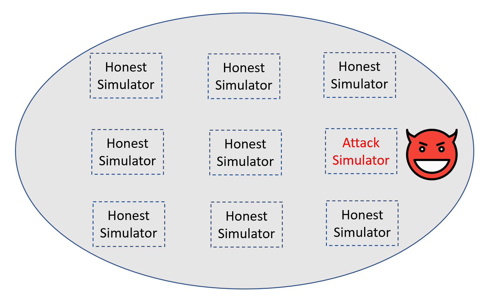

# AttackSimulator

The experiment is conducted with 9 mining nodes.

8 nodes are honest. 
- Compile the poa client without any modifications.
- These nodes will follow the rule of consensus honestly.

1 nodes are malicious. 
- running based on our attack simulator
- modify the source code at the delay time field
